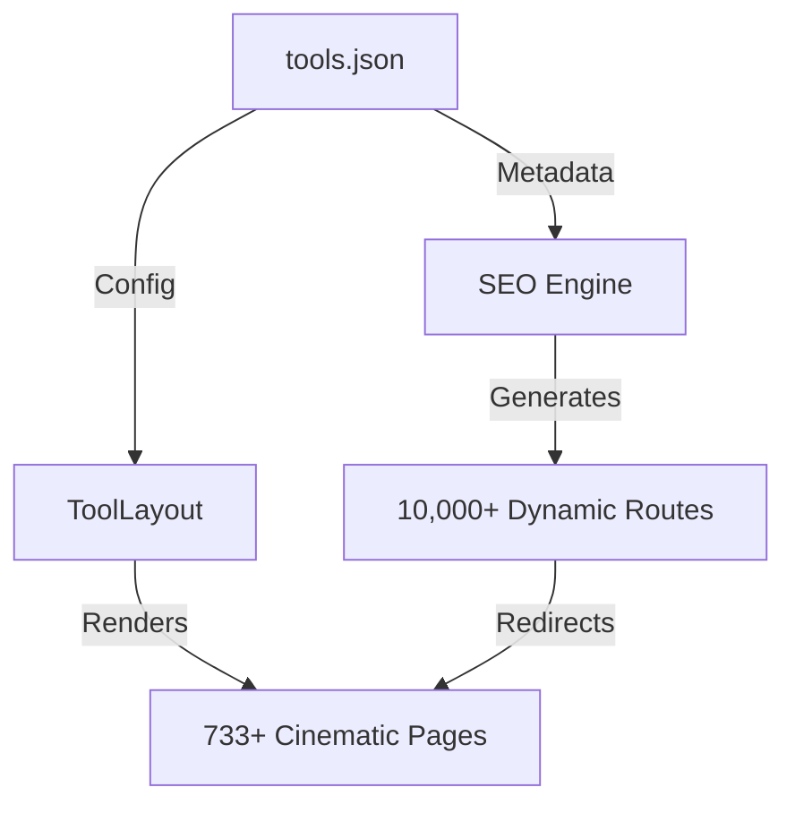

<div align="center">

# 🛠️ 30tools: The Ultimate Utility Engine

### **733+ Pro Tools • 10,000+ SEO Variants • Zero Friction**

[](https://github.com/sh20raj/30tools/stargazers)
[](https://github.com/sh20raj/30tools/blob/main/LICENSE)
[](https://github.com/sh20raj/30tools/issues)
[](https://dash.cloudflare.com/?to=/:account/pages/new)
[](https://nextjs.org/)
[](https://cloudflare.com)

**[30tools.com](https://30tools.com)** is a high-performance, developer-first tool ecosystem designed to dominate search results and provide professional utility at scale.

[Explore all 733+ tools →](https://30tools.com/search)


---

</div>

## 💎 Cinematic Design. Massive Scale.

30tools isn't just a repository of scripts; it's a **Utility Operating System**. Built with Next.js 16 and a premium Glassmorphism design system, it delivers a high-fidelity experience that converts traffic into users.

- **🚀 733+ Primary Tools**: From Image processing to PDF workflows and Social Media downloaders.
- **📈 Infinite SEO**: A programmatically driven routing engine that handles **10,000+ SEO variants** via `extraSlugs` and proxy-level rewrites.
- **✨ Premium UI/UX**: Cinematic workspaces featuring backdrop-blur aesthetics, ambient glows, and high-fidelity micro-interactions.
- **🛡️ Privacy First**: 95% of tool logic runs directly in your browser. No files are uploaded to our servers unless absolutely necessary.
- **⚡ Performance Powered by Bun**: Optimized for ultra-fast build times and low-latency deployments on Cloudflare Workers/Pages.

---

## 🏗️ Architecture

30tools uses a **Data-Driven Architecture** where `tools.json` acts as the single source of truth for the entire platform.



---

## 🛠️ Tech Stack

- **Framework**: [Next.js 15+](https://nextjs.org/) (App Router)
- **Runtime & Tooling**: [Bun](https://bun.sh/)
- **Design System**: [Tailwind CSS](https://tailwindcss.com/) + Custom Glassmorphism Logic
- **UI Components**: [Radix UI](https://www.radix-ui.com/), [Lucide Icons](https://lucide.dev/), [Framer Motion](https://www.framer.com/motion/)
- **SEO & Routing**: Advanced Proxy Engine with Modular Metadata
- **Cloud Infrastructure**: [Cloudflare Pages](https://pages.cloudflare.com/) + [OpenNext](https://open-next.js.org/)

---

## 🏁 Development

### 1. Clone & Install
```bash
git clone https://github.com/sh20raj/30tools.git
cd 30tools
bun install
```

### 2. Launch Workspace
```bash
bun dev
```

Open [http://localhost:3000](http://localhost:3000) to see your workspace.

### 3. Deploy to Cloudflare
```bash
bun run deploy
```

---

## 🤝 Open Source & Contributions

30tools is built by the community, for the community. We believe in high-quality, free software that respects user privacy.

- **Found a bug?** Open an [Issue](https://github.com/sh20raj/30tools/issues).
- **Have a new tool idea?** Check out [CONTRIBUTING.md](CONTRIBUTING.md).
- **Want to help scale?** See [OPEN_SOURCE.md](OPEN_SOURCE.md) for our long-term vision.

---

<div align="center">

## ⭐ Support the Project

If you find this project valuable, please give it a star! It helps us grow the ecosystem and add more tools for everyone.

[](https://github.com/sh20raj/30tools/stargazers)

<br/>

Made with ❤️ and high-performance JS.

</div>